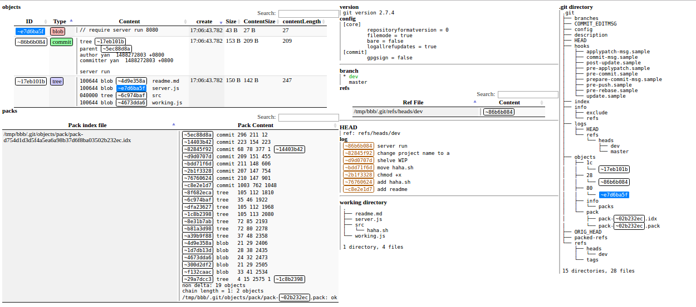

# git-internals

看到颜大大写的[这篇文章](http://yanhaijing.com/git/2017/02/08/deep-git-3/)，很受启发。
然后我自己去读了一遍 Git 文档的[第 10 章](https://git-scm.com/book/zh/v2)，顺便写了一个工具，
来辅助理解文中的各种概念。

## 功能

这个工具能够把 `.git` 下的一些关键文件、目录、配置等一起显示到浏览器里，这样就不需要每次去使用不同的命令查看不同文件内容。 

## 环境依赖

- Linux 或者 Mac，且安装了 `git`,`tree`,`node` 命令行工具

## 使用说明

建一个全新的 Git 仓库：

```sh
mkdir -p /tmp/src
cd /tmp/src
git init
```  

切换到本项目的目录，通过 `REPO_FOLDER` 环境变量指定本地代码仓库的地址，启动 `express` 服务器:

```
npm install
REPO_FOLDER=/tmp/src node server.js
```

通过浏览器打开:

```
http://localhost:3000/
```

回到 `/tmp/src` 目录执行各种 Git 命令，每次执行完命令可以刷新浏览器，查看文件系统的变化。



## 注意

- 如果 Git 的全局配置打开了 `GPG Sign` 可能会让提交的原始文件很长, 可使用 `git config commit.gpgsign false` 临时关闭
- 尽量不要执行 `git gc`，不然就看不到 `loose objects` 的详细记录了
- 因为会调用 `execSync` 但是没有考虑防范命令行注入攻击什么的，所以请在安全的网络环境下实验
